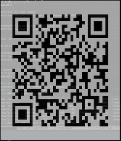

# RQRCode


[](https://github.com/testdouble/standard)

[RQRCode](https://github.com/whomwah/rqrcode) is a library for creating and rendering QR codes into various formats. It has a simple interface with all the standard QR code options. It was adapted from the Javascript library by Kazuhiko Arase.

- QR code is trademarked by Denso Wave inc
- Minimum Ruby version is `>= 3.0.0`

## Installing

Add this line to your application's `Gemfile`:

```ruby
gem "rqrcode", "~> 3.0"
```

or install manually:

```ruby
gem install rqrcode
```

## Basic usage example

```ruby
require "rqrcode"

qr = RQRCode::QRCode.new("https://kyan.com")

puts qr.to_s
# to_s( dark: "x", light: " " ) # defaults

xxxxxxx xxxxxxx  xxx  xxxxxxx
x     x  x  xxx   xx  x     x
x xxx x xx x x     xx x xxx x
x xxx x      xx xx xx x xxx x
x xxx x x x       xxx x xxx x
x     x  xxx x xx x x x     x
...
```

Easy, but unlikely to be readable. For this you will need to use one of the many [rendering options](#render-types) below.

### Advanced Options

These are the various QR code generation options provided by the underlying [rqrcode_core](https://github.com/whomwah/rqrcode_core). You may actually only need this library if you don't need the various rendering options `rqrcode` provides, but just need the data structure.

```
Expects a string or array (for multi-segment encoding) to be parsed in, other args are optional

  data - the string, QRSegment or array of Hashes (with data:, mode: keys) you wish to encode

  size - the size (Integer) of the QR Code (defaults to smallest size needed to encode the data)

  max_size - the max_size (Integer) of the QR Code (default RQRCodeCore::QRUtil.max_size)

  level - the error correction level, can be:
    * Level :l 7%  of code can be restored
    * Level :m 15% of code can be restored
    * Level :q 25% of code can be restored
    * Level :h 30% of code can be restored (default :h)

  mode - the mode of the QR Code (defaults to :alphanumeric or :byte_8bit, depending on the input data,
         only used when data is a string):
    * :number
    * :alphanumeric
    * :byte_8bit
```

Example

```ruby
simple_qrcode = RQRCodeCore::QRCode.new("https://kyan.com", size: 2, level: :m, mode: :byte_8bit)

segment_qrcode = RQRCodeCore::QRCode.new([{ data: "foo", mode: :byte_8bit }])

multi_qrcode = RQRCodeCore::QRCode.new([
  { data: 'foo', mode: :byte_8bit },
  { data: 'BAR1', mode: :alphanumeric }
])
```

## Render types

You probably want to output your QR code in a specific format. We make this easy by providing a bunch of formats to choose from below, each with their own set of options:

### `as_svg`

The SVG renderer will produce a stand-alone SVG as a `String`

```
Options:

offset          - Padding around the QR Code in pixels
                  (default 0)
offset_x        - X Padding around the QR Code in pixels
                  (default offset)
offset_y        - Y Padding around the QR Code in pixels
                  (default offset)
fill            - Background color e.g "ffffff" or :white or :currentColor
                  (default none)
color           - Foreground color e.g "000" or :black or :currentColor
                  (default "000")
module_size     - The Pixel size of each module
                  (defaults 11)
shape_rendering - SVG Attribute: auto | optimizeSpeed | crispEdges | geometricPrecision
                  (defaults crispEdges)
standalone      - Whether to make this a full SVG file, or only an svg to embed in other svg
                  (default true)
use_path        - Use <path> to render SVG rather than <rect> to significantly reduce size.
                  This will become the default in future versions.
                  (default false)
viewbox         - Replace the `svg.width` and `svg.height` attribute with `svg.viewBox` to
                  allow CSS scaling
                  (default false)
svg_attributes  - A optional hash of custom <svg> attributes. Existing attributes will remain.
                  (default {})
```

Example

```ruby
require "rqrcode"

qrcode = RQRCode::QRCode.new("http://github.com/")

# NOTE: showing with default options specified explicitly
svg = qrcode.as_svg(
  color: "000",
  shape_rendering: "crispEdges",
  module_size: 11,
  standalone: true,
  use_path: true
)
```


### `as_png`

The will produce a PNG using the [ChunkyPNG gem](https://github.com/wvanbergen/chunky_png). The result will be a `ChunkyPNG::Image` instance.

```
Options:

fill  - Background <ChunkyPNG::Color>, defaults to 'white'. Use [] for multi args
color - Foreground <ChunkyPNG::Color>, defaults to 'black'. Use [] for multi args

When option :file is supplied you can use the following ChunkyPNG constraints:

color_mode  - The color mode to use. Use one of the ChunkyPNG::COLOR_* constants.
              (defaults to 'ChunkyPNG::COLOR_GRAYSCALE')
bit_depth   - The bit depth to use. This option is only used for indexed images.
              (defaults to 1 bit)
interlace   - Whether to use interlacing (true or false).
              (defaults to ChunkyPNG default)
compression - The compression level for Zlib. This can be a value between 0 and 9, or a
              Zlib constant like Zlib::BEST_COMPRESSION
              (defaults to ChunkyPNG default)

There are two sizing algorithms.

* Original that can result in blurry and hard to scan images
* Google's Chart API inspired sizing that resizes the module size to fit within the given image size.

The Google one will be used when no options are given or when the new size option is used.

*Google Sizing*

size            - Total size of PNG in pixels. The module size is calculated so it fits.
                  (defaults to 120)
border_modules  - Width of white border around the modules.
                  (defaults to 4).

-- DONT USE border_modules OPTION UNLESS YOU KNOW ABOUT THE QUIET ZONE NEEDS OF QR CODES --

*Original Sizing*

module_px_size  - Image size, in pixels.
border          - Border thickness, in pixels

It first creates an image where 1px = 1 module, then resizes.
Defaults to 120x120 pixels, customizable by option.
```

Example

```ruby
require "rqrcode"

qrcode = RQRCode::QRCode.new("http://github.com/")

# NOTE: showing with default options specified explicitly
png = qrcode.as_png(
  bit_depth: 1,
  border_modules: 4,
  color_mode: ChunkyPNG::COLOR_GRAYSCALE,
  color: "black",
  file: nil,
  fill: "white",
  module_px_size: 6,
  resize_exactly_to: false,
  resize_gte_to: false,
  size: 120
)

IO.binwrite("/tmp/github-qrcode.png", png.to_s)
```


### `as_ansi`

The ANSI renderer will produce as a string with ANSI color codes.

```
Options:

light           - Foreground ANSI code
                  (default "\033[47m")
dark            - Background ANSI code
                  (default "\033[40m")
fill_character  - The written character
                  (default '  ')
quiet_zone_size - Padding around the edge
                  (default 4)
```

Example

```ruby
require "rqrcode"

qrcode = RQRCode::QRCode.new("http://github.com/")

# NOTE: showing with default options specified explicitly
svg = qrcode.as_ansi(
  light: "\033[47m", dark: "\033[40m",
  fill_character: "  ",
  quiet_zone_size: 4
)
```



## API Documentation

[http://www.rubydoc.info/gems/rqrcode](http://www.rubydoc.info/gems/rqrcode)

## Tests

You can run the test suite using:

```
$ bundle install
$ rake      # runs specs and standard:fix
$ rake spec # just runs the specs
```

or try the lib from the console with:

```
$ ./bin/console
```

## Linting

The project uses [standardrb](https://github.com/testdouble/standard) and can be used with:

```
$ bundle install
$ rake standard # checks
$ rake standard:fix # fixes
```

## Contributing

I am not currently accepting any new renderers as the current `as_png`, `as_svg` and `as_ansi` work for most cases. If you need something different from what's available, the [`rqrcode_core`](https://github.com/whomwah/rqrcode_core) gem gives you access to all the QR Code information you will need so makes it simple to generate your own.

The motivation for the above is because the rendering side of this gem takes up the most time. It seems that many people want a slightly different version of a QR Code so supporting all the variations would be hard. The easiest way is to empower people to create their own versions which they can manage and share. This is what `rqrcode_core` does.

Any contribution PR's will be greatly accepted. It's important that they are well tested and backwards compatible.

- Fork the project
- Send a pull request
- Don't touch the .gemspec, I'll do that when I release a new version

Thanks D.

## Authors

Original RQRCode author: Duncan Robertson

A massive thanks to [all the contributors of the library over the years](https://github.com/whomwah/rqrcode/graphs/contributors). It wouldn't exist if it wasn't for you all.

Oh, and thanks to my bosses at https://kyan.com for giving me time to maintain this project.

## Resources

- wikipedia:: http://en.wikipedia.org/wiki/QR_Code
- Denso-Wave website:: http://www.denso-wave.com/qrcode/index-e.html
- kaywa:: http://qrcode.kaywa.com

## Copyright

MIT License (http://www.opensource.org/licenses/mit-license.html)
